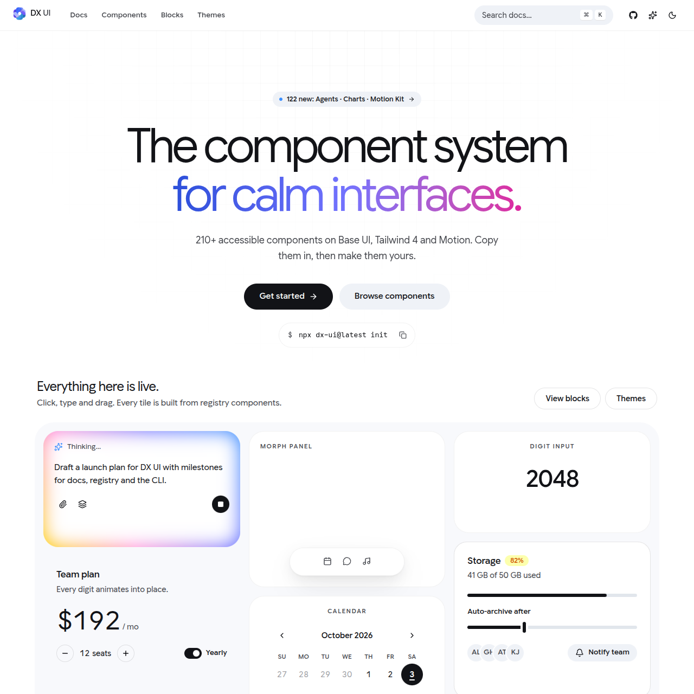

# DesignX UI
 


Accessible, motion-first React components built on [Base UI](https://base-ui.com), [Tailwind CSS 4](https://tailwindcss.com), and [Motion](https://motion.dev).

DesignX UI is not a dependency you wrap. You copy components into your project, and the source becomes yours to read, change, and ship. The CLI handles registry dependencies, npm packages, and import aliases.

**Documentation:** [dxuireact.com](https://dxuireact.com)

## Quick start

DesignX UI requires React 19, Tailwind CSS 4, and TypeScript. The CLI requires Node.js 18.17 or later.

```bash
npx @sidioralabs/designx-ui@latest init
npx @sidioralabs/designx-ui@latest add button card dialog
```

`init` writes `dx.json`, adds the theme stylesheet and `lib/utils.ts`, and installs the base dependencies. `add` installs components along with any registry items they depend on.

```tsx
import { Button } from "@/components/ui/button"

export default function App() {
  return <Button>Hello DX</Button>
}
```

## CLI

The npm package is `@sidioralabs/designx-ui`. It provides the `dx-ui` command.

| Command | Description | Options |
| --- | --- | --- |
| `init` | Set up a project | `-y, --yes` · `--css <path>` · `--registry <url>` |
| `add [components...]` | Add components and their dependencies | `-a, --all` · `-o, --overwrite` · `-p, --path <dir>` |
| `list` | List everything in the registry | |

Every command accepts `--cwd <dir>`. See [`cli/README.md`](cli/README.md) for details.

## Using the shadcn CLI

The registry follows the shadcn `registry-item` schema. Add DesignX UI as a namespaced registry in `components.json`:

```json
{
  "registries": {
    "@dx": "https://dxuireact.com/r/{name}.json"
  }
}
```

```bash
npx shadcn@latest add @dx/theme @dx/button
```

## What's included

- **UI:** accessible primitives such as buttons, dialogs, menus, forms, tables, and charts
- **DX Motion:** expressive micro-interactions such as smooth carets, rolling digits, and gooey filters
- **Agents:** chat, prompt input, tool approval, streaming, and reasoning components for AI interfaces
- **Charts and blocks:** data visualisations and full page sections

Browse the full catalog at [dxuireact.com](https://dxuireact.com).

## Development

This repository contains the documentation site, the component sources, the registry build, and the CLI.

| Path | Contents |
| --- | --- |
| `src/web/` | Documentation site and component sources |
| `scripts/` | Registry generation and validation |
| `public/r/` | Generated registry JSON |
| `cli/` | The `@sidioralabs/designx-ui` CLI package |

You need [Bun](https://bun.sh) 1.3 or later and Node.js 22.

```bash
bun install
bun run dev        # start the documentation site
bun run lint       # lint with oxlint
bun run check      # lint, typecheck, validate the registry, test the CLI
bun run build      # generate the registry and build the site
```

Component sources live in `src/web/components`. After changing one, run `bun run registry` to regenerate `public/r/`.

## Releases

Pushes to `main` publish the CLI to npm automatically when the version in `cli/package.json` isn't on npm yet. Each publish runs the full build and CLI checks first and includes npm provenance. See the [changelog](CHANGELOG.md) for release notes.

## Contributing

Issues and pull requests are welcome. Read the [contributing guide](CONTRIBUTING.md) to get started, and please follow our [Code of Conduct](CODE_OF_CONDUCT.md).

- Need help? See [SUPPORT.md](SUPPORT.md).
- Found a vulnerability? Report it privately as described in [SECURITY.md](SECURITY.md).

## License

[MIT](LICENSE) © Sidiora Labs
